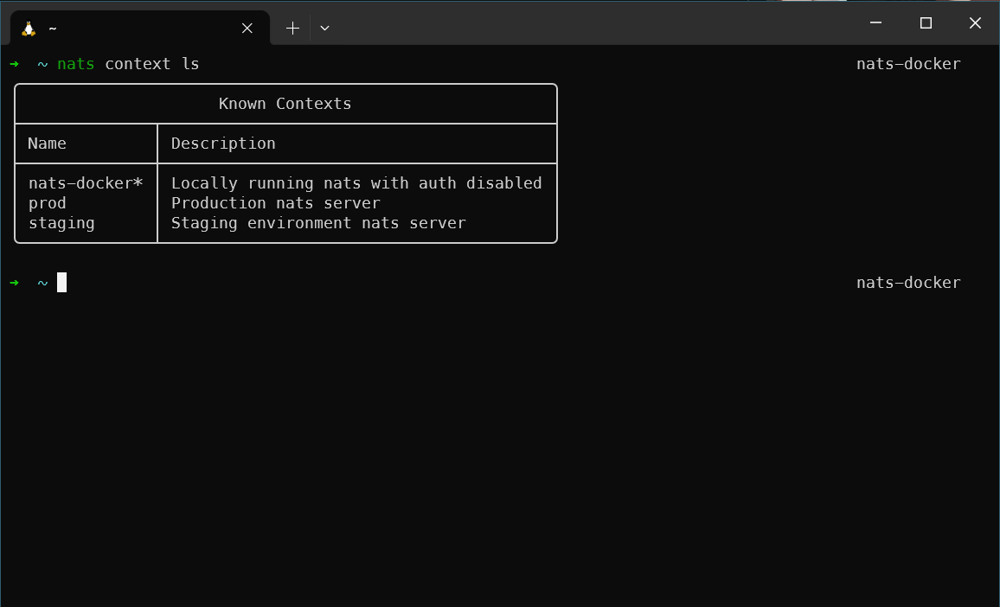

# zsh-nats

An [ohmyzsh](https://ohmyz.sh/) plugin for the [NATS CLI](https://github.com/nats-io/natscli).

Requires [jq](https://jqlang.org/download/) to be installed and accessible on your PATH.

## Installation

Clone the repo to your zsh plugins directory.

```shell
git clone https://github.com/caproven/zsh-nats.git $ZSH_CUSTOM/plugins/zsh-nats
```

Then add `zsh-nats` to your plugins list in `~/.zshrc`.

```shell
plugins=(... zsh-nats)
```

## Prompt Info

Plugin adds the `nats_prompt_info` function for use in shell prompting. More info on prompt customization can be found [here](https://linuxhandbook.com/customize-zsh-prompt/).

For example, the current NATS context can be added to the right side of your prompt by adding the following to your `~/.zshrc`.

```shell
RPS1='$(nats_prompt_info)'
```



## Aliases

TODO
